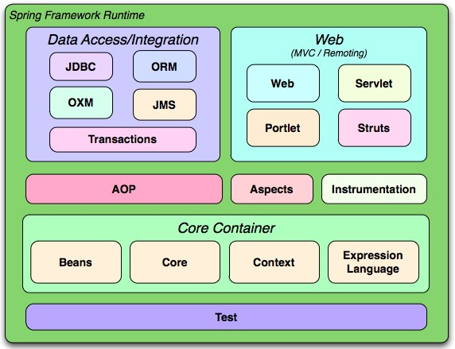

# Spring基础  

## 基本概念  

### 1.概念  

&emsp;&emsp;Spring是一个开源框架，Spring是于2003 年兴起的一个轻量级的Java 开发框架，由Rod Johnson 在其著作Expert One-On-One J2EE Development and Design中阐述的部分理念和原型衍生而来。它是为了解决企业应用开发的复杂性而创建的。Spring使用基本的JavaBean来完成以前只可能由EJB完成的事情。然而，Spring的用途不仅限于服务器端的开发。从简单性、可测试性和松耦合的角度而言，任何Java应用都可以从Spring中受益。简单来说，Spring是一个轻量级的控制反转（IoC）和面向切面（AOP）的容器框架。  

### 2.优势  

* 方便解耦，简化开发：专门负责生成Bean；

* AOP编程的支持：Spring提供面向切面编程，声明式事务的支持；

* 方便程序的测试：对Junit4支持，可以通过注解方便的测试Spring程序；

* 方便集成各种优秀框架：其内部提供了对各种优秀框架，如：Struts、Hibernate、MyBatis等；

* 降低JavaEE API的使用难度：对JavaEE开发中一些难用的API都提供了封装，如JDBC、JavaMail、远程调用webservice等。

### 3.体系结构  
<div align="center">
	
</div>

### 4.核心jar包  
* spring-core-xxx.jar：包含Spring框架基本的核心工具类； 

* spring-beans-xxx.jar：访问配置文件、创建和管理bean，IoC、DI相关操作； 

* spring-context-xxx.jar：在基础IoC功能上的扩展服务，此外还提供许多企业级服务的支持,如邮件服务、任务调度、JNDI定位、EJB集成、远程访问、缓存以及各种视图层框架的封装等； 

* spring-expression-xxx.jar：spring表达式语言；  


## IoC  

在配置文件中指定类文件的路径，使用property进行属性或者对象的注入。

### 1.xml配置方式  

类文件  
```java
package com.tomster.spring.service;

import org.springframework.stereotype.Service;

/**
 * @author meihewang
 * @date 2019/10/31  0:17
 */
public class UserService {

    private String name;

    public String getName() {
        return name;
    }

    public void setName(String name) {
        this.name = name;
    }

    public void addUser() {
        System.out.println("add user: " + name);
    }
}
```

XML配置文件  
```xml
<?xml version="1.0" encoding="UTF-8"?>
<beans xmlns="http://www.springframework.org/schema/beans"
       xmlns:xsi="http://www.w3.org/2001/XMLSchema-instance"
       xsi:schemaLocation="
http://www.springframework.org/schema/beans http://www.springframework.org/schema/beans/spring-beans.xsd">


    <!-- 配置一个bean对象-->
    <bean id="userService" class="com.tomster.spring.service.UserService">
        <property name="name" value="tomster"></property>
    </bean>

</beans>
```

调用方式  
```java
ApplicationContext applicationContext = new ClassPathXmlApplicationContext("beans.xml");
UserService userService = (UserService)applicationContext.getBean("userService");
userService.addUser();
```    

加载spring容器的三种方法：  
```java
//1.通过ClassPathXmlApplicationContext类路径加载[最常用]
ApplicationContext applicationContext = new ClassPathXmlApplicationContext("beans.xml");

//2.通过文件系统路径获得配置文件[绝对路径]
ApplicationContext applicationContext = new FileSystemXmlApplicationContext("E:\\projects\\Java-Notes\\spring-learning\\src\\beans.xml");

//3.BeanFactory[了解]
String path = "E:\\projects\\Java-Notes\\spring-learning\\src\\beans.xml";
BeanFactory beanFactory = new XmlBeanFactory(new FileSystemResource(path));
UserService userService = (UserService)beanFactory.getBean("userService");
userService.addUser();
```   
BeanFactory和ApplicationContext区别：

* BeanFactory：BeanFacotry是spring中比较原始的Factory。如XMLBeanFactory就是一种典型的BeanFactory，目前已经弃用了。采用延迟加载，第一次调用getBean时才会加载Bean。

* ApplicationContext：继承自BeanFactory，对其进行功能拓展，支持国际化，事件机制，载入多个context，事务和aop等等。获取实现该接口容器的实例时，就将容器内所有的Bean全部实例化。


## DI  

依赖注入可以通过XML配置方式和注解方式完成

### 1.xml配置方式  

#### 1.1 一般形式  

类文件
```java
package com.tomster.di.model;

/**
 * @author meihewang
 * @date 2019/11/03  21:55
 */
public class Student{

    private String username;
    private String password;
    private Integer age;

    //setter and getter Omitted...

    public Student() {
    }

    public Student(String username, String password) {
        this.username = username;
        this.password = password;
    }

    public Student(String username, Integer age) {
        this.username = username;
        this.age = age;
    }
}
```

XML配置文件  
```xml
<!-- 1.构造方法 -->
<!-- 通过属性名称 -->
<bean id="student1" class="com.tomster.di.model.Student">
    <constructor-arg name="username" value="wmh"></constructor-arg>
    <constructor-arg name="password" value="123456"></constructor-arg>
</bean>
<!-- 通过索引和类型 -->
<bean id="student2" class="com.tomster.di.model.Student">
    <constructor-arg index="0" value="wmh" type="java.lang.String"></constructor-arg>
    <constructor-arg index="1" value="26" type="java.lang.Integer"></constructor-arg>
</bean>


<!-- 2. setter方法 -->
<bean id="student3" class="com.tomster.di.model.Student">
    <property name="username" value="wmh"></property>
    <property name="password" value="123456"></property>
</bean>
```

构造方法可以用指定属性名称， 或者索引和类型来确定调用哪个构造函数创建Bean；  
property标签方式是直接给属性赋值，调用属性的setter方法，setter方法去掉会异常。  


#### 1.2 对象注入  

类文件  

Address.java  

```java
package com.tomster.di.model;

/**
 * @author meihewang
 * @date 2019/11/03  22:48
 */
public class Address {

    private String name;

    //setter and getter Omitted...
}
```


Customer.java  
```java
package com.tomster.di.model;

/**
 * @author meihewang
 * @date 2019/11/03  22:44
 */
public class Customer {

    private String name;
    private String sex;
    private double pi;
    private Address address;

    //setter and getter Omitted...
}
```

xml配置文件

```xml
<!--
    SpEL:spring表达式
    <property name="" value="#{表达式}">
    #{123}、#{'jack'} ： 数字、字符串
    #{T(类).字段|方法}	：静态方法或字段
    #{beanId}	：另一个bean引用
    #{beanId.propName}	：操作数据
    #{beanId.toString()}	：执行方法
-->
<bean id="address" class="com.tomster.di.model.Address">
    <property name="name" value="shanghai"></property>
</bean>

<bean id="customer" class="com.tomster.di.model.Customer">
    <property name="name" value="wmh"></property>
    <property name="sex" value="#{'male'}"></property>
    <property name="pi" value="#{T(java.lang.Math).PI}"></property>
    <!-- 一个对象注入另一个的方式 -->
    <!--<property name="address" value="#{address}"></property>-->
    <property name="address" ref="address"></property>
</bean>

```  

xml配置方式将一个对象注入另一个对象，使用ref指定注入对象的id

#### 1.3 集合注入  

类文件  

```java
package com.tomster.di.model;

import java.util.Arrays;
import java.util.List;
import java.util.Map;

/**
 * @author meihewang
 * @date 2019/11/03  23:19
 */
public class Programmer {

    List<String> books;
    Map<String, String> infos;
    String[] schools;

    //setter and getter Omitted...

}

```  

xml配置文件  

```xml
<bean id="programmer" class="com.tomster.di.model.Programmer">
    <!--列表-->
    <property name="books">
        <list>
            <value>jvm</value>
            <value>java</value>
            <value>spring</value>
        </list>
    </property>
    <!--map-->
    <property name="infos">
        <map>
            <entry key="name" value="wmh"></entry>
            <entry key="age" value="26"></entry>
            <entry key="position" value="t11"></entry>
        </map>
    </property>
    <!--数组-->
    <property name="schools">
        <array>
            <value>JIT</value>
            <value>SHU</value>
        </array>
    </property>

</bean>

```
列表，map和数组注入元素分别用list,map和array，另还有set和value标签。  


### 2.注解方式  

常用注解  
* @component：取代了xml配置文件中的bean标签，默认参数表示id
* @Controller-Service-Repository：mvc三层
* @Autowired：自动根据类型注入
* @Qualifier(“名称”)：指定自动注入的id名称

xml开启注解，指定包扫描位置
```xml
<!-- 开启注解-->
<context:annotation-config/>
<!-- 注解的位置-->
<context:component-scan base-package="com.tomster"/>
```

## AOP  

### 1. 概念  

&emsp;&emsp;Aspect Oriented Programming的缩写，意为：面向切面编程，通过预编译方式和运行期动态代理实现程序功能的统一维护的一种技术。AOP采取横向抽取机制，取代了传统纵向继承体系重复性代码。利用AOP可以对业务逻辑的各个部分进行隔离，从而使得业务逻辑各部分之间的耦合度降低，提高程序的可重用性，同时提高了开发的效率。经常应用于事务管理、性能监视、安全检查、缓存 、日志等需求。

### 2. 术语  

* Target：目标类，需要被代理的类  
* Proxy：代理类  
* Joinpoint：可能被拦截到的方法
* PointCut：已经被增强的连接点
* Advice：通知/增强，增强代码。例如：after、before  
* Weaving：织入，把增强应用到目标对象来创建新的代理对象的过程  
* Aspect: 切面类。切入点和通知的结合  

### 3. 手动实现AOP  
Target类
```java
package com.tomster.aop.service;

/**
 * @author meihewang
 * @date 2019/11/05  23:50
 */
public class UserServiceImpl implements IUserService {
    @Override
    public void addUser() {
        System.out.println("add user");
    }

    @Override
    public void updateUser() {
        System.out.println("update user");
    }

    @Override
    public void deleteUser() {
        System.out.println("delete user");
    }
}
```  

切面类
```java
package com.tomster.aop.aspect;

/**
 * @author meihewang
 * @date 2019/11/05  23:52
 */
public class MyAspect {

    public void before(){
        System.out.println("begin...");
    }

    public void after(){
        System.out.println("end...");
    }

}
```  

工厂类  
```java
package com.tomster.aop.factory;

import com.tomster.aop.aspect.MyAspect;
import com.tomster.aop.service.IUserService;
import com.tomster.aop.service.StudentService;
import com.tomster.aop.service.UserServiceImpl;
import com.tomster.spring.service.UserService;
import org.springframework.cglib.proxy.Enhancer;
import org.springframework.cglib.proxy.MethodInterceptor;
import org.springframework.cglib.proxy.MethodProxy;

import java.lang.reflect.InvocationHandler;
import java.lang.reflect.Method;
import java.lang.reflect.Proxy;

/**
 * @author meihewang
 * @date 2019/11/06  0:11
 */
public class MyBeanFactory {

    public static IUserService createUserService() {
        final IUserService userService = new UserServiceImpl();
        final MyAspect aspect = new MyAspect();

        IUserService userServiceP = (IUserService) Proxy.newProxyInstance(MyBeanFactory.class.getClassLoader(),
                UserServiceImpl.class.getInterfaces(), new InvocationHandler() {
                    @Override
                    public Object invoke(Object proxy, Method method, Object[] args) throws Throwable {

                        aspect.before();
                        Object invoke = method.invoke(userService, args);
                        aspect.before();
                        return invoke;
                    }
                });

        return userServiceP;
    }


    public static StudentService createCglibService() {
        final StudentService studentService = new StudentService();
        final MyAspect aspect = new MyAspect();
        Enhancer enhancer = new Enhancer();
        enhancer.setSuperclass(studentService.getClass());
        enhancer.setCallback(new MethodInterceptor() {
            @Override
            public Object intercept(Object proxy, Method method, Object[] args, MethodProxy methodProxy) throws Throwable {
                aspect.before();
                Object retObj = methodProxy.invokeSuper(proxy,args);
                aspect.after();
                return retObj;
            }
        });

        return  (StudentService)enhancer.create();
    }
}

```  

测试方式以及输出结果  
```java
//jdk dynamic proxy
@Test
public void test1(){
    IUserService userService = MyBeanFactory.createUserService();
    userService.addUser();
}
//cglib dynamic proxy
@Test
public void test3(){
    StudentService cglibService = MyBeanFactory.createCglibService();
    cglibService.addStudent();
}

//output
begin...
add Student
end...
```

jdk动态代理和cglib动态代理的区别：  
1. JDK动态代理只能对实现了接口的类生成代理，而不能针对类。CGLIB是针对类实现代理，主要是对指定的类生成一个子类，覆盖其中的方法。  
2. 如果目标对象实现了接口，默认情况下会采用JDK的动态代理实现AOP；如果目标对象没有实现了接口，必须采用CGLIB库。Spring会自动在JDK动态代理和CGLIB之间转换。


### 4. AspectJ


#### 4.1 xml配置方式

目标对象
```java
package com.tomster.aop.service;

/**
 * @author meihewang
 * @date 2019/11/05  23:50
 */
public class UserServiceImpl implements IUserService {
    @Override
    public void addUser() {
        System.out.println("add user");
    }

    @Override
    public void updateUser() {
        System.out.println("update user");
    }

    @Override
    public void deleteUser() {
        System.out.println("delete user");
    }
}

```
切面类
```java
package com.tomster.aop.aspect;

import org.aspectj.lang.ProceedingJoinPoint;

/**
 * @author meihewang
 * @date 2019/11/06  23:15
 */
public class MyAspect3 {
    public void myBefore(){
        System.out.println("前置通知...");
    }

    public void myAfterReturning(){
        System.out.println("后置通知...");
    }

    public Object myAround(ProceedingJoinPoint pjp) throws Throwable {
        System.out.println("环绕通知...");
        System.out.println("开启事务...");
        //放行
        Object retObj = pjp.proceed();
        System.out.println("提交事务...");
        return retObj;
    }
}


```
xml配置文件

```xml
<!-- 配置切面对象-->
<bean id="myAspect3" class="com.tomster.aop.aspect.MyAspect3"></bean>

<!-- 配置 aop -->
<aop:config>
    <!-- aop:指定切面-->
    <aop:aspect ref="myAspect3">
        <!--定义一个切入点-->
        <aop:pointcut id="myPointcut" expression="execution(* com.tomster.aop.service.UserServiceImpl.*(..))"/>

        <!-- 配置前置通知...-->
        <aop:before method="myBefore" pointcut-ref="myPointcut" />
        <!-- 配置后置通知...-->
        <aop:after-returning method="myAfterReturning" pointcut-ref="myPointcut"/>
        <!--配置环绕通知-->
        <aop:around method="myAround" pointcut-ref="myPointcut"></aop:around>
    </aop:aspect>
</aop:config>
```

测试类及结果
```java
ApplicationContext applicationContext = new ClassPathXmlApplicationContext("beans-aspectj.xml");
IUserService userService = (IUserService)applicationContext.getBean("userService");
userService.addUser();

前置通知...
环绕通知...
开启事务...
add user
提交事务...
后置通知...
```

#### 4.2 注解配置方式  
目标类
```java
package com.tomster.aspectj.service;

import org.springframework.stereotype.Service;

/**
 * @author meihewang
 * @date 2019/11/05  23:50
 */
@Service("userService")
public class UserServiceImpl implements IUserService {
    @Override
    public void addUser() {
        System.out.println("add user");
    }

    @Override
    public void updateUser() {
        System.out.println("update user");
    }

    @Override
    public void deleteUser() {
        System.out.println("delete user");
    }
}
```

切面类
```java
package com.tomster.aspectj.aspect;

import org.aspectj.lang.ProceedingJoinPoint;
import org.aspectj.lang.annotation.Around;
import org.aspectj.lang.annotation.Aspect;
import org.springframework.stereotype.Component;

/**
 * @author meihewang
 * @date 2019/11/05  23:52
 */
@Component
@Aspect
public class MyAspect {

    @Around("execution(* com.tomster.aspectj.service.*.*(..))")
    public Object around(ProceedingJoinPoint processJoinPoint){
        System.out.println("begin...");
        Object response = null;
        try {
            response = processJoinPoint.proceed(processJoinPoint.getArgs());
            System.out.println("finish...");

        } catch (Throwable throwable) {
            throwable.printStackTrace();
        }
        return response;
    }
}
```

xml配置文件
```xml
<!-- 配置扫描注解的位置 -->
<context:component-scan base-package="com.tomster.aspectj"/>

<!-- 配置aop注解生效-->
<aop:aspectj-autoproxy></aop:aspectj-autoproxy>
```
测试代码及输出
```java
ApplicationContext applicationContext = new ClassPathXmlApplicationContext("beans-aspectj-anno.xml");
IUserService userService = (IUserService)applicationContext.getBean("userService");
userService.addUser();

begin...
add user
finish...
```


