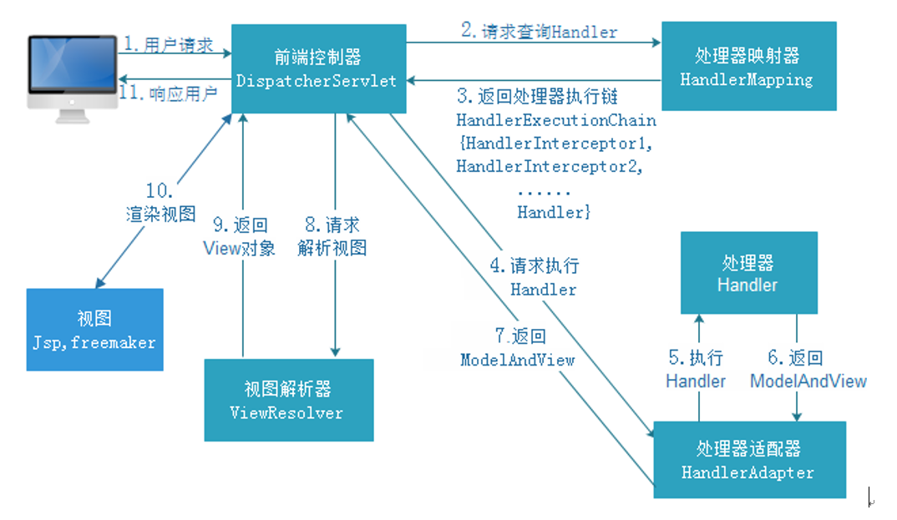
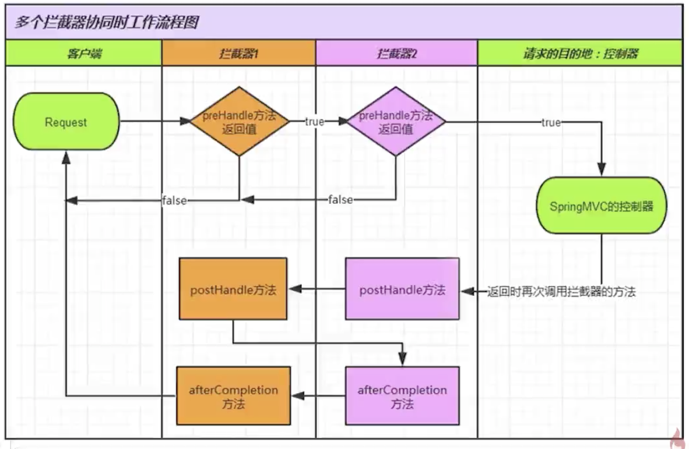

# Spring MVC基础  

## 初始化和流程  
### 1.概念  
&emsp;&emsp;Spring MVC是Spring提供给Web应用的框架设计.Spring MVC的流程和各个组件的应用是其根本。MVC设计不仅限于Java Web应用，还包括前端、PHP等语言，根本原因在于解耦各个模块。使用MVC后一个根本的好处在于前台和后台得到了一定的分离，但仍然有一定的耦合。对于后端而言，由于控制器和模型层的分离，使得大量的代码可以得到重用。 

### 2.流程  
Spring MVC的核心在于流程，这是使用Spring MVC框架的基础。Spring MVC是一种基于Servlet的技术，提供了核心控制器DispatcherServlet和相关组件。Spring MVC是围绕着DispatcherServlet工作的。
<div align="center">
	
</div>

### 3.基本配置
dispatcher-servlet.xml
```xml
<!-- 1.配置url处理映射-->
<bean class="org.springframework.web.servlet.handler.BeanNameUrlHandlerMapping"/>
<!-- 2.配置控制器处理适配器-->
<bean class="org.springframework.web.servlet.mvc.SimpleControllerHandlerAdapter"/>
<!-- 3.配置控制器-相当于配置了访问路径-->
<bean name="/user.do" class="com.tomster.backoffice.web.controller.UserController"/>
<!-- 4.配置资源视图解析器-->
<bean class="org.springframework.web.servlet.view.InternalResourceViewResolver">
    <!--前缀-->
    <property name="prefix" value="/WEB-INF/views/"></property>
    <!--后缀-->
    <property name="suffix" value=".jsp"></property>
</bean>
```

web.xml
```xml
<!-- 配置：所有请求由SpringMVC管理 -->
<servlet>
    <servlet-name>DispatcherServlet</servlet-name>
    <servlet-class>org.springframework.web.servlet.DispatcherServlet</servlet-class>
    <load-on-startup>1</load-on-startup>
</servlet>

<servlet-mapping>
    <servlet-name>DispatcherServlet</servlet-name>
    <url-pattern>*.do</url-pattern>
</servlet-mapping>
```

### 4.注解配置
&emsp;&emsp;Servlet3.0之后的规范允许取消web.xml配置，只是用注解即可。首先继承AbstractAnnotationConfigDispatcherServletInitializer类。因为AbstractAnnotationConfigDispatcherServletInitializer类实现了WebApplicationInitializer接口，实现这个接口的类接口都会被SpringServletContainerInitializer类加载作为初始化器。  

## 开发流程

### 1.注解开发
Spring MVC目前主要由注解开发  
@controller:分发处理器将会扫描使用了该注解的类的方法，并检测该方法是否使用了@RequestMapping 注解;  
@RequestMapping:处理请求地址映射,属性value表示映射名，method表示请求类型，可以用GetMapping或PostMapping;  
@RequestParam:后台控制层获取参数,value参数名，required是否必须，默认true;defaultValue默认值;  
@ResponseBody:支持restful风格  
示例  
```java
@RestController
@RequestMapping("roleManager")
public class RroleManagerController {
    
    @GetMapping("/query")
    public Response<Object> query(
            @RequestParam(required = false) Integer id,
            @RequestParam(required = false) String name,
            @RequestParam(required = false, defaultValue = "1") Integer pageNo,
            @RequestParam(required = false, defaultValue = "10") Integer pageSize) {
    //...
    }
```  


### 2.控制器接收参数  
### 2.1 接收普通请求参数  
```java
public ModelAndView commonParams(String roleName, String note){
    //表单数据传递参数名称一致，不需要注解也可以获取参数
}
```  

### 2.2 使用@RequestParam注解获取参数
```java
public ModelAndView requestParams(@RequestParam("role_name") String roleName, String note){
    //role_name为指定的http参数名称
}
```  

### 2.3 使用URL传递参数
```java
@RequestMapping(/getRole/{id})
public ModelAndView pathVariable(@PathVariable("id") Long id){
    //从URL地址中获取参数
}
```

### 2.4 传递JSON参数
```java
@RequestMapping(/findRoles)
public ModelAndView findRoles(@ResponseBody RolesParams rolesParams){
    //RolesParams为pojo，使用对象封装参数
}
```
## 3.保存并获取属性参数  
@RequestAttribute: 获取request对象的属性值，传递给控制器的参数;  
@SessionAttribute: 获取session中的属性值;   
@SessionAttributes: 设置键值对，只能对类使用;  
@CookieValue: 从cookie中获取信息;  
@RequestHeader: 请求头中获取信息。  

## 4.拦截器  
### 4.1 定义
拦截器可以在控制器之前或之后做一些操作   
Spring要求所有的拦截器都要事先HandlerInterceptor接口，该接口有三个方法：
preHandle：在控制器之前执行的前置方法；  
postHandle：在控制器之后执行的后置方法； 
afterCompletion：无论是否产生异常都会在渲染视图后执行的方法。    

### 4.2 执行流程  
前置方法(preHandle)-> 控制器(Handler) -> 后置方法(postHandle) -> 完成方法(afterCompletion)
<div align="center">
	
</div>

### 4.3 配置拦截器
```xml
<!-- 配置拦截器 -->
<mvc:interceptors>
    <mvc:interceptor>
        <!-- 所有的请求都进入拦截器 -->
        <mvc:mapping path="/**" />
        <!-- 配置具体的拦截器 -->
        <bean class="" />
    </mvc:interceptor>
</mvc:interceptors>
```  

## 5.验证表单  
&emsp;&emsp;得到数据的第一步是校验数据的有效性，可以使用@valid对javaBean进行校验，可以在bean的属性上设置注解验证，@Null,@AssertTrue,@Min(value),@Size(max,min),@Pattern,@Future等等。  

JavaBean
```java
public class NewBookDto {
    @Min(value = 1, message = "id无效")
    private int categoryId;
    @NotBlank(message="名称不能为空")
    private String bookName;
    @NotBlank(message="描述不能为空")
    private String bookDescription;
}
```

controller
```java
@PostMapping("/add")
public Response<Object> add(@RequestBody @Valid NewBookDto newBookDto, BindingResult bindingResult) {
    //...
}
```  

比较复杂的业务逻辑校验可以通过Spring提供的Validator接口来实现。验证器Validator通过supports方法判定是否启用验证器去验证数据；validate方法去检验数据的合法性。手写验证器实现Validator接口，用@InitBind将验证器和控制器捆粄在一起，对数据进行验证。  

